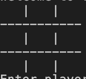

# TicTacToeDart

This is the game of Tic Tac Toe in the language dart. 

## How to play
- Run the TicTacToe.dart file
- The board will print itself 

- It will prompt you when its player X or player O's turn
- Enter your input understanding 0,0 is on the top left position and 2,2 is on the bottom right 
- Beat your friend!
- For the general rules of Tic Tac Toe visit the link [here](https://www.wikihow.com/Play-Tic-Tac-Toe)